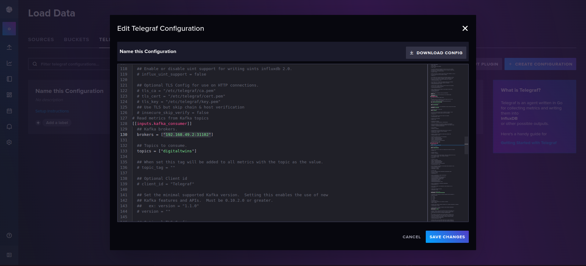
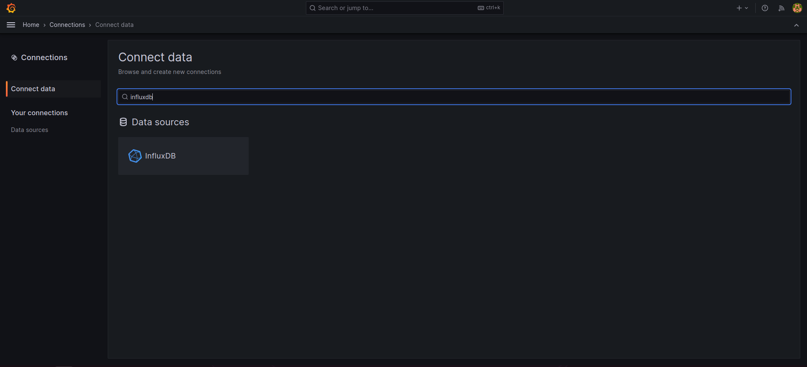

__Perspicuous documentation for__ __[`OpenTwins`](https://github.com/ertis-research/opentwins/tree/main)__ __platform by__ __[Eshan Jayasundara](https://www.linkedin.com/in/eshan-jayasundara/).__

# 1. Quick deployment

## Simplified Architecture of the Essential Functionality


## Prerequisits
+ [Minikube single node kubernetes cluster](https://minikube.sigs.k8s.io/docs/start/?arch=%2Flinux%2Fx86-64%2Fstable%2Fbinary+download) (for container ocaustration)
+ [Kubctl](https://kubernetes.io/docs/tasks/tools/install-kubectl-linux/#install-using-native-package-management) (kubernetes command line interface for intract with minikube cluster)
+ [Docker](https://docs.docker.com/engine/install/ubuntu/#install-using-the-repository) (for containarization)
+ [Helm](https://helm.sh/docs/intro/install/) (to copy charts from the helm repository)
+ Linux base Operating System (tested on ubuntu)

## Steps to follow

### Start minikube cluster
```
minikube start --cpus 4 --disk-size 40gb --memory 8192 -p <name-of-the-profile>
```
change `name-of-the-profile` field as you need but keep it remember for later steps.

### Create a namespace in Kubernetes
```
kubectl create namespace <your-own-name-space>
```
replace `your-own-name-space` with as you wish but keep it remembered for future use.

### Add helm repository into the charts
```
helm repo add ertis https://ertis-research.github.io/Helm-charts/
```

### Install OpenTwins (https://ertis-research.github.io/opentwins/docs/installation/using-helm)
```
helm upgrade --install opentwins ertis/OpenTwins -n <your-own-name-space> --dependency-update --debug
```

### Wait until all the services, pods, and deployments are up and running after installation
+ To check the status of pods
```
kubectl get pods -n <your-own-name-space>
```
+ To check the status of services
```
kubectl get services -n <your-own-name-space>
```
+ To check the deployments
```
kubectl get deployments -n <your-own-name-space>
```
_you may need to check those with executing the above commands repeatedly in another terminal_

### If some pods are in the Completed state
```
kubectl delete pod <pod-name> -n <your-own-name-space>
```
Take a note of them. Run the above command by replacing `pod_name` with the actual pod name and `your-own-name-space` with the namespace that you have noted before.

### Access Grafana from the browser
```
minikube service -n <your-own-name-space> opentwins-grafana --url -p <name-of-the-profile>
```
The default username and password both are “admin”

### At this point the cluster needs a restart to detect the OpenTwins GUI (maybe optional)
```
minikube stop -p <name-of-the-profile>
minikube start -p <name-of-the-profile>
```
Ensure everything is back up and running

### Log into Grafana and access the OpenTwins plugin 
`Home -> Administration -> Plugins -> OpenTwins`

___The plugin needs some configuration. The default ditto username and password is “ditto”. For the developer account username is "devops" and password is "foobar". As for the URLs use the outputs of the following commands.___
```
minikube service -n <your-own-name-space> opentwins-ditto-nginx --url -p <name-of-the-profile>

minikube service -n <your-own-name-space> opentwins-ditto-extended-api --url -p <name-of-the-profile>
```
Make sure to replace `name-of-the-profile` and `your-own-name-space`.

### Types and Twins Creation

Here I'm going to create a digital twin for a sensor that measures the temperature, humidity, and CO2 level.

#### Creating a Type
click on `create new type` button

provide the necessary details and fill the form. __Don't forget to use the `default_policy` as the policy.__

Add features

finally, the preview of the type in Ditto protocol looks like this


#### Creating a Twin Using Type Template
click on `create new twin` button

provide the necessary namespace and id. __Don't use the same names used for creating twins because they are the instances of the type which we have created above.__

from `existing types` choose the one just created before as the `type of twin`.

##### Finally the preview of the twin in the Ditto protocol looks like this


### Establish mqtt-5 connection in ditto
__`Important:`__</br>
__Replace uri s with actual ones in your cluster including the curl command url.__</br>
__Python script and this connection request both should have the same topic.__
```
curl -i -u devops:foobar -X POST http://192.168.49.2:30525/api/2/connections -H 'Content-Type: application/json' -d '{
  "name": "mymqtt_connection",
  "connectionType": "mqtt-5",
  "connectionStatus": "open",
  "uri": "tcp://192.168.49.2:30511",
  "sources": [
    {
      "addresses": [
        "telemetry/#"
      ],
      "consumerCount": 1,
      "qos": 1,
      "authorizationContext": [
        "nginx:ditto"
      ],
      "headerMapping": {
        "correlation-id": "{{header:correlation-id}}",
        "namespace": "{{ entity:namespace }}",
        "content-type": "{{header:content-type}}",
        "connection": "{{ connection:id }}",
        "id": "{{ entity:id }}",
        "reply-to": "{{header:reply-to}}"
      },
      "replyTarget": {
        "address": "{{header:reply-to}}",
        "headerMapping": {
          "content-type": "{{header:content-type}}",
          "correlation-id": "{{header:correlation-id}}"
        },
        "expectedResponseTypes": [
          "response",
          "error"
        ],
        "enabled": true
      }
    }
  ],
  "targets": [],
  "clientCount": 1,
  "failoverEnabled": true,
  "validateCertificates": true,
  "processorPoolSize": 1,
  "tags": []
}'
```

find ditto url with,
```
minikube service -n <your-own-namespace> opentwins-ditto-nginx --url -p <name-of-the-profile>
```

find mosquitto url with,
```
minikube service -n <your-own-namespace> opentwins-mosquitto --url -p <name-of-the-profile>
```

```
# check connections with
curl -i -X GET -u devops:foobar http://192.168.49.2:30525/api/2/connections

# delete a connection
curl -i -X DELETE -u devops:foobar http://192.168.49.2:30525/api/2/connections/<connection-name>
```

### Testing with a Python Script

__You may use ditto [protocol preview of digital twin](#finally-the-preview-of-the-twin-in-Ditto-protocol-looks-like-this) to assign necessary values to the variables in this python file.__

```
import paho.mqtt.client as mqtt
import random
import time
import json

# Digital twin info
namespace = "airquality"
sensor_name = "mysensor"

# MQTT info
broker = "192.168.49.2"  # Replace with your MQTT broker address
port = 30511  # Replace with your MQTT broker port
topic = "telemetry/"  # Topic where data will be published

# Authentication info (replace with actual username and password)
username = ""
password = ""

# MQTT connection
def on_connect(client, userdata, flags, rc):
    if rc == 0:
        print("Successful connection")
    else:
        print(f"Connection failed with code {rc}")

client = mqtt.Client()
client.on_connect = on_connect
client.username_pw_set(username, password)
client.connect(broker, port, 60)

def generate_air_data():
    temperature = random.uniform(15, 45)
    humidity = random.uniform(0, 100)
    co2 = random.uniform(0, 5)
    return temperature, humidity, co2

def get_ditto_protocol_value_air(time, temperature, humidity, co2):
    return {
        "temperature": {
            "properties": {
                "value": temperature,
                "time": time
            }
        },
        "humidity": {
            "properties": {
                "value": humidity,
                "time": time
            }
        },
        "co2": {
            "properties": {
                "value": co2,
                "time": time
            }
        }
    }

def get_ditto_protocol_msg(name, value):
    return {
        "topic": f"{namespace}/{name}/things/twin/commands/merge",
        "headers": {
            "content-type": "application/merge-patch+json"
        },
        "path": "/features",
        "value": value
    }

# Send data
try:
    client.loop_start()  # Start the MQTT loop

    while True:
        t = round(time.time() * 1000)  # Unix time in ms

        # Sensor twin
        temperature, humidity, co2 = generate_air_data()
        msg = get_ditto_protocol_msg(sensor_name, get_ditto_protocol_value_air(t, temperature, humidity, co2))
        client.publish(topic + namespace + "/" + sensor_name, json.dumps(msg))
        print(f"{sensor_name} data published")

        time.sleep(5)

except KeyboardInterrupt:
    client.loop_stop()  # Stop the MQTT loop
    client.disconnect()
```

After configuring all, run the Python script. Twin should show the published information as shown in the image below,


### Deploying the kafka pod into the same minikube cluster
For Kafka to work, it is necessary to install ZooKeeper beforehand. In addition, CMAK, a tool to manage Apache Kafka, will be used to make it easier to use. Then, for the deployment, the pod-zookeeper.yaml, svc-zookeeper.yaml, pod-kafka.yaml, svc-kafka.yaml, deploy-kafka-manager.yaml and svc-kafka-manager.yaml files will be needed. Once you have them, you only need to apply them to the chosen namespace.

```
# envirinment variable
export NS = <your-own-name-space> # replace this with your namespace

kubectl apply -f pod-zookeeper.yaml -n $NS
kubectl apply -f svc-zookeeper.yaml -n $NS

kubectl apply -f pod-kafka.yaml -n $NS
kubectl apply -f svc-kafka.yaml -n $NS

kubectl apply -f deploy-kafka-manager.yaml -n $NS
kubectl apply -f svc-kafka-manager.yaml -n $NS
```

After manual deployment all services may look like this,
```
kafka-cluster                  LoadBalancer
kafka-manager                  NodePort
opentwins-ditto-extended-api   NodePort
opentwins-ditto-gateway        ClusterIP
opentwins-ditto-nginx          NodePort
opentwins-grafana              NodePort
opentwins-influxdb2            NodePort  
opentwins-mongodb              NodePort    
opentwins-mosquitto            NodePort  
zookeeper                      NodePort  
```
If there is a service type different from the above, please use the command below and edit the service type,
```
kubectl edit service <service-name> -n <your-own-namespace>
```
replace `<service-name>` and `<your-own-namespace>` with actual names.

### Establishing Kafka connection in Ditto

__`Important:`__</br>
__Replace uri s with actual ones in your cluster including the curl command URL.__</br>

There are two methods, please use only one from below.</br>

+ 1st method
```
curl -i -X POST -u devops:foobar -H 'Content-Type: application/json' --data '{
  "targetActorSelection": "/system/sharding/connection",
  "headers": {
    "aggregate": false
  },
  "piggybackCommand": {
    "type": "connectivity.commands:createConnection",
    "connection": {
        "id": "kafka-connection",
        "connectionType": "kafka",
        "connectionStatus": "open",
        "failoverEnabled": true,
        "uri": "tcp://192.168.49.2:31102",
        "specificConfig": {
            "bootstrapServers": "192.168.49.2:31102",
            "saslMechanism": "plain"
        },
        "sources": [],
        "targets": [
            {
            "address": "digitaltwins",
            "topics": [
                "_/_/things/twin/events",
                "_/_/things/live/messages"
            ],
            "authorizationContext": [
                "nginx:ditto"
            ]
            }
        ]
    }
  }
}' http://192.168.49.2:30525/devops/piggyback/connectivity
```

+ 2nd method
```
curl -i -u devops:foobar -X POST http://192.168.49.2:30525/api/2/connections -H 'Content-Type: application/json' -d '{
	"name": "new-connetion",
        "connectionType": "kafka",
        "connectionStatus": "open",
        "failoverEnabled": true,
        "uri": "tcp://192.168.49.2:31102",
        "specificConfig": {
            "bootstrapServers": "192.168.49.2:31102",
            "saslMechanism": "plain"
        },
        "sources": [],
        "targets": [
            {
            "address": "digitaltwins",
            "topics": [
                "_/_/things/twin/events",
                "_/_/things/live/messages"
            ],
            "authorizationContext": [
                "nginx:ditto"
            ]
            }
        ]
}'
```

find ditto url with,
```
minikube service -n <your-own-namespace> opentwins-ditto-nginx --url -p <name-of-the-profile>
```

find kafka url with,
```
minikube service -n <your-own-namespace> kafka-cluster --url -p <name-of-the-profile>
```

Ensure the connections were configured in ditto

```
# check connections with
curl -i -X GET -u devops:foobar http://192.168.49.2:30525/api/2/connections

# delete a connection
curl -i -X DELETE -u devops:foobar http://192.168.49.2:30525/api/2/connections/<connection-name>
```

### Telegraf + Influxdb configuration
Influxdb pod comes default with the minikube cluster which you have just created initially,

access influxdb + telegraf URL with
```
kubectl get services -n <your-own-name-space> # list all services

minikube service -n <your-own-name-space> <influxdb-service-name> --url -p <name-of-the-profile>
```
__`user name: admin`__</br>
__`password: password`__


generate an API token with all permissions and copy it to chipboard using Influxdb UI


copy the apikey/token by selecting and right clicking on it.


Click Create a configuration

Choose "default" bucket and kafka-consumer plugin

download the configuration which already displays kafka-consumer as input plugin and influxdb_v2 as output plugin after replacing the token, ClusterIP, relevent ports of kafka broker and influxdb services


### Update ConfigMaps in the Cluster
accessing configmaps
```
kubectl get configmaps -n <your-own-namespace>
```
editing them
```
kubectl edit configmap <telegraf> -n <your-own-namespace>
```
__`telegraf`__ - __represents all configmaps including the substring "telegraf"__</br>

edit all configmaps using downloaded file (mostly may look like the below example)
</br>

for example:
```
data:
  telegraf.conf: |
    [agent]
      collection_jitter = "0s"
      debug = true
      flush_interval = "10s"
      flush_jitter = "0s"
      hostname = "" #
      interval = "10s"
      metric_batch_size = 1000
      metric_buffer_limit = 10000
      omit_hostname = false
      precision = ""

    [[outputs.influxdb_v2]]
      bucket = "default"
      organization = "opentwins"
      token = <your-token-extracted>
      urls = ["<influxdb-url>"]

    [[inputs.kafka_consumer]]
      brokers = ["<kafka-broker-url>"]
      topics = ["digitaltwins"]
      consumer_group = "telegraf_metrics_consumers"
      offset = "oldest"
      data_format = "json"
```

__dont forget to replace `<your-token-extracted>`__ with actual token.

find the relevent influxdb, kafka urls with,
```
minikube service -n <your-own-namespace> opentwins-influxdb2 --url -p <name-of-the-profile>

minikube service -n <your-own-namespace> kafka-cluster --url -p <name-of-the-profile>
```

redeploy the telegraf deployment
```
kubectl rollout restart deployment telegraf -n opentwins
```

### visualising in grafana

`Home -> Connections -> Connect data -> Search for InfluxDB`

create a new InfluxDB data source

Configure it as sown in the images below
```
minikube service -n <your-own-namespace> opentwins-influxdb2 --url -p <name-of-the-profile>
```
find the URL with the above command


Save and test the connection


create a new dashboard</br>
`Home -> Dashboards`

And choose InfluxDB as the data source for quering


example query:
```
import "strings"

from(bucket: "default")
  |> range(start: v.timeRangeStart, stop: v.timeRangeStop)
  |> filter(fn: (r) => r["_measurement"] == "kafka_consumer")
  |> filter(fn: (r) => r["host"] == "telegraf-57cfdcb85c-dgflc")
  |> filter(fn: (r) => r["_field"] == "value_co2_properties_value" or r["_field"] == "value_humidity_properties_value" or r["_field"] == "value_temperature_properties_value")

```
`filter(fn: (r) => r["host"] == "telegraf-57cfdcb85c-dgflc")`</br>

`telegraf-57cfdcb85c-dgflc` is the name of telegraf pod. I had to change this wehenever restarting the minikube cluster because I got different telegraf pod names after restarting the minikube cluster using `minikube stop -p <name-of-the-profile>` and `minikube start -p <name-of-the-profile>` and the pod name also includes with the time series data.

___`This issue is to fix soon by using a permenent pod name`___

### The final dashboard should look like this


#### Congratulations you're all set.

# 2. In detail about deployment
